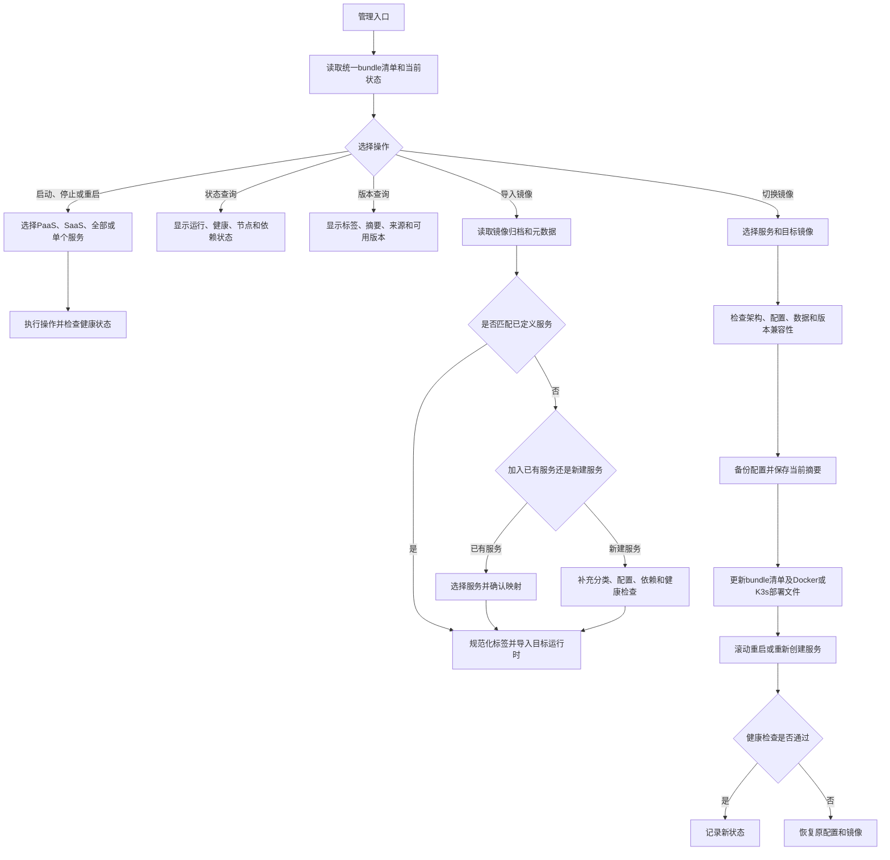

# Workflow

Use this reference when planning a new bundle, modifying an existing bundle, or explaining the execution state to the user.

## Main Flow

```mermaid
flowchart TB
    START([开始]) --> TASK{任务类型}

    TASK -->|新建安装包| REQUIREMENT[收集并确认需求]
    TASK -->|改造现有安装包| SCAN[扫描现有包和仓库结构]
    SCAN --> CHANGE_SCOPE{确认改造范围}
    CHANGE_SCOPE -->|管理脚本| REQUIREMENT
    CHANGE_SCOPE -->|增删服务| REQUIREMENT
    CHANGE_SCOPE -->|升级镜像| REQUIREMENT
    CHANGE_SCOPE -->|配置或其他改造| REQUIREMENT

    REQUIREMENT --> ENVIRONMENT[确认系统、架构、网络、权限和测试环境]
    ENVIRONMENT --> DEPLOY_TARGET{部署目标}
    DEPLOY_TARGET -->|Docker| INVENTORY
    DEPLOY_TARGET -->|K3s| K3S_TOPOLOGY[确认server和agent拓扑及登录方式]
    DEPLOY_TARGET -->|Docker和K3s| K3S_TOPOLOGY
    K3S_TOPOLOGY --> INVENTORY[建立完整服务和镜像清单]

    INVENTORY --> CONTENT_SCOPE{安装包内容范围}
    CONTENT_SCOPE -->|完整| SELECT_FULL[选择全部PaaS和SaaS服务]
    CONTENT_SCOPE -->|仅PaaS| SELECT_PAAS[筛选PaaS服务]
    CONTENT_SCOPE -->|仅SaaS| SELECT_SAAS[筛选SaaS服务]
    CONTENT_SCOPE -->|自定义| SELECT_CUSTOM[交互式选择服务]

    SELECT_FULL --> PACKAGE_MODE
    SELECT_PAAS --> DEPENDENCY_POLICY
    SELECT_SAAS --> DEPENDENCY_POLICY
    SELECT_CUSTOM --> DEPENDENCY_POLICY

    DEPENDENCY_POLICY{未选中的依赖如何处理}
    DEPENDENCY_POLICY -->|一并包含| INCLUDE_DEPENDENCIES[加入必要依赖]
    DEPENDENCY_POLICY -->|使用外部服务| EXTERNAL_DEPENDENCIES[记录外部地址和安装前检查]
    DEPENDENCY_POLICY -->|分层安装包| LAYERED_DEPENDENCIES[生成包依赖和版本约束]
    INCLUDE_DEPENDENCIES --> PACKAGE_MODE
    EXTERNAL_DEPENDENCIES --> PACKAGE_MODE
    LAYERED_DEPENDENCIES --> PACKAGE_MODE

    PACKAGE_MODE{安装包类型}
    PACKAGE_MODE -->|完整可安装包| INSTALLABLE[准备镜像、配置、运行时和脚本]
    PACKAGE_MODE -->|仅镜像包| IMAGES_ONLY[只准备镜像、摘要、清单和导入脚本]
    PACKAGE_MODE -->|升级包| UPGRADE[准备差异、迁移、升级和回滚内容]

    INSTALLABLE --> IMAGE_SOURCE
    IMAGES_ONLY --> IMAGE_SOURCE
    UPGRADE --> IMAGE_SOURCE

    IMAGE_SOURCE{镜像来源}
    IMAGE_SOURCE -->|公共仓库| VERSION[解析兼容版本和可信摘要]
    IMAGE_SOURCE -->|私有仓库| REGISTRY[确认地址、认证方式和证书]
    IMAGE_SOURCE -->|用户提供| PROVIDED[核验镜像文件、架构和摘要]
    REGISTRY --> VERSION
    PROVIDED --> CLASSIFY

    VERSION --> SECURITY[检查漏洞、许可证、来源和兼容性]
    SECURITY --> SECURITY_RESULT{符合安全策略}
    SECURITY_RESULT -->|是| ACQUIRE[下载或复制并按可信摘要核验]
    SECURITY_RESULT -->|存在兼容安全版本| VERSION
    SECURITY_RESULT -->|需要风险接受| EXCEPTION[说明风险并请求明确确认]
    SECURITY_RESULT -->|不可接受| FAIL([终止并输出原因])
    EXCEPTION --> ACQUIRE

    ACQUIRE --> CLASSIFY[标记PaaS或SaaS、服务归属和依赖]
    CLASSIFY --> MANIFEST[生成统一bundle清单、部署配置和环境变量模板]
    MANIFEST --> ARTIFACTS{是否仅镜像包}
    ARTIFACTS -->|是| VALIDATE
    ARTIFACTS -->|否| RUNTIME[准备Docker、Compose或K3s运行时文件]
    RUNTIME --> MODULES[生成安装、导入、管理、升级和回滚模块]
    MODULES --> REPORTER[生成安装后部署与运维报告模块]
    REPORTER --> VALIDATE[执行静态检查和自动化测试]

    VALIDATE --> VALID_RESULT{检查是否通过}
    VALID_RESULT -->|否| FIX[修复问题并记录变化]
    FIX --> VALIDATE
    VALID_RESULT -->|是| PACKAGE[生成安装包、校验清单、SBOM或来源记录和说明文档]

    PACKAGE --> TEST_HOST{是否提供Linux测试环境}
    TEST_HOST -->|否| STATIC_ONLY[标记仅完成静态验证]
    TEST_HOST -->|是| CONFIRM_REMOTE[确认上传和执行测试]
    CONFIRM_REMOTE --> INSTALL_TEST[执行安装、重复安装、升级和回滚测试]
    INSTALL_TEST --> TEST_RESULT{测试是否通过}
    TEST_RESULT -->|否| FIX
    TEST_RESULT -->|是| SUCCESS([交付完成])
    STATIC_ONLY --> SUCCESS
```

## Management Flow

## Modification Flow

For an existing bundle:

1. Inventory the current files, service definitions, scripts, image archives, checksums, and generated outputs.
2. Reconstruct or update the bundle manifest before editing duplicated deployment files.
3. Calculate the requested delta: add, remove, upgrade, reclassify, or change deployment target.
4. Preserve user-managed configuration unless the user explicitly approves migration or replacement.
5. Regenerate only affected adapters and artifacts.
6. Test both the changed path and compatibility with an existing installation.
