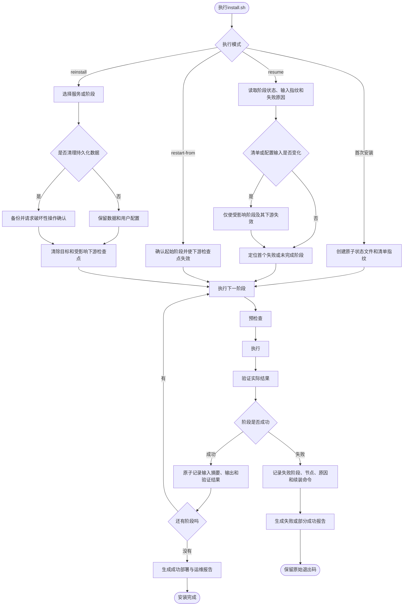
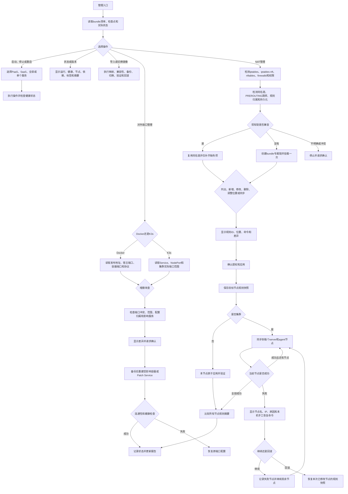

# Workflow

Use this reference when planning a new bundle, modifying an existing bundle, or explaining the execution state to the user.

## Main Flow

```mermaid
flowchart TB
    START([开始]) --> TASK{任务类型}

    TASK -->|新建安装包| REQUIREMENT[收集并确认需求]
    TASK -->|改造现有安装包| SCAN[扫描现有包、清单、脚本和生成物]
    SCAN --> FW_SCAN[扫描iptables、nftables、firewalld和持久化操作]
    FW_SCAN --> FW_EXISTING{是否已有bundle专属NAT链}
    FW_EXISTING -->|已确认归属和用途| FW_REUSE[记录并复用原链名和挂载位置]
    FW_EXISTING -->|没有| REQUIREMENT
    FW_EXISTING -->|归属不明或冲突| FW_CONFIRM[列出候选链、规则和影响并请求确认]
    FW_REUSE --> REQUIREMENT
    FW_CONFIRM --> REQUIREMENT

    REQUIREMENT --> ENVIRONMENT[确认系统、架构、网络、权限和测试环境]
    ENVIRONMENT --> DEPLOY_TARGET{部署目标}
    DEPLOY_TARGET -->|Docker| INVENTORY
    DEPLOY_TARGET -->|K3s或两者| K3S_TOPOLOGY[确认server和agent拓扑、名称、IP及登录方式]
    K3S_TOPOLOGY --> INVENTORY[建立完整服务、镜像和依赖清单]

    INVENTORY --> CONTENT_SCOPE{安装包内容范围}
    CONTENT_SCOPE -->|完整| SELECT_FULL[选择全部PaaS和SaaS服务]
    CONTENT_SCOPE -->|仅PaaS| SELECT_PAAS[筛选PaaS服务]
    CONTENT_SCOPE -->|仅SaaS| SELECT_SAAS[筛选SaaS服务]
    CONTENT_SCOPE -->|自定义| SELECT_CUSTOM[交互式选择服务]

    SELECT_FULL --> HAS_SAAS
    SELECT_PAAS --> DEPENDENCY_POLICY
    SELECT_SAAS --> HAS_SAAS
    SELECT_CUSTOM --> HAS_SAAS

    HAS_SAAS{是否包含SaaS组件}
    HAS_SAAS -->|否| DEPENDENCY_POLICY
    HAS_SAAS -->|是| SAAS_DEPENDENCIES[枚举每个SaaS依赖的全部PaaS和外部目标]
    SAAS_DEPENDENCIES --> DEP_INIT{SaaS启动前是否初始化依赖数据或配置}
    DEP_INIT -->|是| INIT_PLAN[定义来源、摘要、目标、顺序、幂等、备份、验证和回滚]
    DEP_INIT -->|否| INIT_SKIP[记录跳过原因和前置条件]
    INIT_PLAN --> CONFIG_AUDIT[核对SaaS启动配置和凭据注入方式]
    INIT_SKIP --> CONFIG_AUDIT
    CONFIG_AUDIT --> CONNECTION_CHECK[定义安装前连接和配置一致性检查]
    CONNECTION_CHECK --> DEPENDENCY_POLICY

    DEPENDENCY_POLICY{未选中的依赖如何处理}
    DEPENDENCY_POLICY -->|一并包含| INCLUDE_DEPENDENCIES[加入必要依赖]
    DEPENDENCY_POLICY -->|使用外部服务| EXTERNAL_DEPENDENCIES[记录外部地址和安装前检查]
    DEPENDENCY_POLICY -->|分层安装包| LAYERED_DEPENDENCIES[生成包依赖和版本约束]
    INCLUDE_DEPENDENCIES --> PACKAGE_MODE
    EXTERNAL_DEPENDENCIES --> PACKAGE_MODE
    LAYERED_DEPENDENCIES --> PACKAGE_MODE

    PACKAGE_MODE{安装包类型}
    PACKAGE_MODE -->|完整可安装包| INSTALLABLE[准备镜像、配置、运行时和脚本]
    PACKAGE_MODE -->|仅镜像包| IMAGES_ONLY[只准备镜像、摘要、清单和导入脚本]
    PACKAGE_MODE -->|升级包| UPGRADE[准备差异、迁移、升级和回滚内容]

    INSTALLABLE --> IMAGE_SOURCE
    IMAGES_ONLY --> IMAGE_SOURCE
    UPGRADE --> IMAGE_SOURCE

    IMAGE_SOURCE{镜像来源}
    IMAGE_SOURCE -->|公共仓库| VERSION[解析兼容版本和可信摘要]
    IMAGE_SOURCE -->|私有仓库| REGISTRY[确认地址、认证方式和证书]
    IMAGE_SOURCE -->|用户提供| PROVIDED[核验镜像文件、架构和摘要]
    REGISTRY --> VERSION
    PROVIDED --> CLASSIFY

    VERSION --> SECURITY[检查漏洞、许可证、来源和兼容性]
    SECURITY --> SECURITY_RESULT{符合安全策略}
    SECURITY_RESULT -->|是| ACQUIRE[下载或复制并按可信摘要核验]
    SECURITY_RESULT -->|存在兼容安全版本| VERSION
    SECURITY_RESULT -->|需要风险接受| EXCEPTION[说明风险并请求明确确认]
    SECURITY_RESULT -->|不可接受| FAIL([终止并输出原因])
    EXCEPTION --> ACQUIRE

    ACQUIRE --> CLASSIFY[标记PaaS或SaaS、服务归属和依赖]
    CLASSIFY --> MANIFEST[生成bundle清单、初始化计划、部署配置和环境变量模板]
    MANIFEST --> ARTIFACTS{是否仅镜像包}
    ARTIFACTS -->|是| VALIDATE
    ARTIFACTS -->|否| RUNTIME[准备Docker、Compose或K3s运行时文件]
    RUNTIME --> MODULES[生成可续装安装、重装、管理、升级和回滚模块]
    MODULES --> NETWORK[生成Docker端口、NodePort和bundle专属NAT管理模块]
    NETWORK --> REPORTER[生成安装后部署与运维报告模块]
    REPORTER --> VALIDATE[执行静态检查和自动化测试]

    VALIDATE --> VALID_RESULT{检查是否通过}
    VALID_RESULT -->|否| FIX[修复问题并记录变化]
    FIX --> VALIDATE
    VALID_RESULT -->|是| PACKAGE[生成安装包、校验清单、SBOM或来源记录和说明文档]

    PACKAGE --> TEST_HOST{是否提供Linux测试环境}
    TEST_HOST -->|否| STATIC_ONLY[标记仅完成静态验证]
    TEST_HOST -->|是| CONFIRM_REMOTE[确认上传和执行测试]
    CONFIRM_REMOTE --> INSTALL_TEST[执行安装、失败续装、重装、升级、端口、NAT和回滚测试]
    INSTALL_TEST --> TEST_RESULT{测试是否通过}
    TEST_RESULT -->|否| FIX
    TEST_RESULT -->|是| SUCCESS([交付完成])
    STATIC_ONLY --> SUCCESS
```

## Installation, Resume, and Reinstall Flow

Stage order for a bundle that contains SaaS is: preflight, runtime, image import, PaaS deployment or dependency validation, declared dependency initialization, SaaS configuration validation, SaaS deployment, approved exposure and NAT changes, health validation, and reporting. Skip only stages that are not applicable and record the reason.

## Management Flow

In non-interactive mode, a node failure must stop unless the caller explicitly supplied an on-failure policy of `continue` or `rollback`. Continuing never turns the failed node into a success: retain its node name, IP, error, and exact local command in state and in the deployment report.

## Modification Flow

For an existing bundle:

1. Inventory the current files, service definitions, scripts, image archives, checksums, generated outputs, installation state, and user-managed overrides.
2. Inspect installation, management, uninstall, persistence, systemd, iptables, iptables-restore, nftables, and firewalld code before proposing network changes.
3. Reconstruct or update the bundle manifest before editing duplicated deployment files.
4. If an existing user-defined NAT chain and PREROUTING jump are verified as bundle-owned and semantically compatible, preserve their exact chain name and placement. Do not create a parallel chain.
5. Calculate the requested delta: add, remove, upgrade, reclassify, change deployment target, change bootstrap data, expose ports, or manage NAT rules.
6. Preserve user-managed configuration and persistent data unless the user explicitly approves migration or replacement.
7. Regenerate only affected adapters and artifacts.
8. Test both the changed path and compatibility with an existing installation, including repeated execution and resume after a controlled failure.
