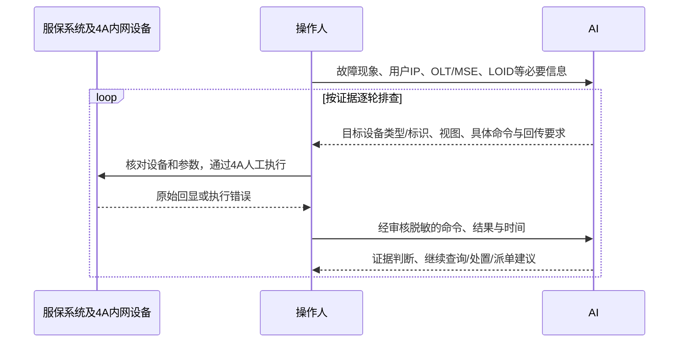

# 手动交互流程

## 流程与角色

本流程依据用户更新后的“服保系统 / 操作人 / AI”泳道图：AI返回具体命令及应查询的设备类型；操作人搬运命令、执行并回传结果，循环至继续查询、处置或派单决定。



这是人工搬运闭环，不要求内网安装Python、联网、运行SecureCRT脚本或生成结构化文件。3A是认证查询系统，4A是设备访问/审计入口，二者不能混淆。

## 最小资源与首轮选择

只补充当前步骤的必要信息，已给过的有效资源不重复索取。

| 当前任务 | 生成命令前必须知道 | 可暂缺 |
|---|---|---|
| 按会话查MSE/SR | 已确认目标设备、厂商及适配信息、IP/账号/WAN MAC至少一个；华三需明确PPPoE或IPoE | OLT端口、LOID、业务子接口 |
| 按接口查静态业务 | 目标设备/厂商、业务接口；路由查询另需确认全局或实例及目的IP | 拨号账号、LOID |
| 查询OLT ONU | 目标OLT/厂商/型号、命令所需PON类型/端口/ONU ID、必要视图 | MSE子接口 |
| 用LOID定位 | 已确认中兴OLT型号及EPON业务、LOID，且相应模板适用 | 待查询获取的PON端口/ONU ID |
| 指定源Ping | 目标设备、路由上下文、该上下文可用的设备本地源IP、工单相关目的IP | 无关客户信息 |
| 3A页面查询 | 已开放查询能力、可用查询标识、所需时间范围 | 设备CLI参数 |

只有LOID不能推导槽位、PON口或ONU ID。不是已确认适用的中兴EPON定位场景时，先请操作人查服保资源/台账，或补充经确认的定位手册。

设备标识未知时可建议“查承载本线路的MSE”，但不可伪造名称/IP并发出可执行命令。原手册只列厂商而未限定型号的条目，也须操作人确认本设备版本/视图适用。

按现象建议路径，不锁死OLT → MSE → 3A顺序：

- 明确光猫离线：建议接入OLT的状态、离线/光信息。
- 拨号失败：建议实际承载MSE/SR的用户会话及相关失败记录；必要时查3A。
- 静态交付：优先相关业务接口、正确实例下路由及邻接，不因缺少会话判故障。
- 掉线：匹配故障时间与历史记录；当前在线不能否认历史掉线。
- 丢包、慢速：相关接口/聚合及有限探测；需要计数增量时，人工间隔采样并记录时间，不清计数器。
- 部分业务不通：保留失败/正常目标对照；现有命令不能覆盖的应用、策略、DNS等问题列为协查，不补造设备命令。

## 一轮命令的形态

以下仅为虚构示例；地址使用文档示例网段，不可用于实际工单。

操作人已确认：工单DEMO-01；PPPoE；目标华为MSE，标识MSE-A；设备版本、当前查询视图及命令授权已核对；用户IP为192.0.2.10。

AI应输出：

【执行目标】MSE / 华为 / MSE-A；查询用户192.0.2.10；在已确认支持本命令的当前查询视图执行。

【本轮命令】`huawei_mse.session_user_ip`；来源：MSE、SR指令需求!C4；只读、目标用户范围；目的：确认本设备是否存在该IP会话。

```text
display access-user ip-address 192.0.2.10
```

【请回传】本条命令、完整回显、设备提示符及执行时间，涉及敏感字段先按单位规则脱敏。

随后必须等待。不能在尚未拿到会话/资源对应信息时编造子接口、实例或OLT端口。

若回传“权限拒绝”，记录查询未完成，保留原报错并请权限维护核验；不能改结论为“用户不在线”或自动换账户重试。

## 回传与轮次记录

接受零散回显，不强制操作人填表。内部维护：

| 字段 | 用途 |
|---|---|
| 工单与对象 | 电路/用户别名、设备别名、接口、业务方式和实例，避免串单 |
| 轮次与命令 | R01-Q01等轮次标识，对应命令编号、实际参数、执行视图 |
| 时间 | 用户报障时间、执行时间、设备记录时间及已知时钟偏差 |
| 执行状态 | 成功有结果 / 成功无匹配 / 权限拒绝 / 语法或视图错误 / 超时 / 分页截断 / 未执行 |
| 证据与待办 | 本轮事实、置信程度、是否解释故障、未查项、下一步 |

回传来自多个设备时先按设备/命令拆分；对象或时间无法确认时，只分析可归属部分并要求补足关键关联。新结果覆盖旧状态时保留时间，不把历史状态当当前状态。

分页或截图缺页时，请补目标相关上下文和结束提示符；不把被截断部分当空结果，也不擅自新增关闭分页命令。

跨会话接续时请提供最近阶段性记录，不假定能访问先前会话。

## 判定与停止条件

- **明确异常**：有可引用证据，并说明与故障现象和时间是否相符；可进入定向处置/派单，但不能声称已经修复。
- **疑似异常**：列出支持和缺失证据，选能区分原因的最小补充查询。
- **已查项未见异常**：限定到本次设备、对象、时间、命令范围；尚未查到的链路/业务不能被宣布正常。
- **信息不足**：执行失败、对象未知、关键字段缺失、未获授权或回显不清，不能按正常处理。

判读限制沿用原标准动作：

- 光值记录收/发方向、数值、单位和对应设备/模块阈值来源；阈值未知则待核验，不设通用光功率合格线。
- 仅未见MAC/ARP/会话不能单独判定设备损坏、欠费或断纤。先核对对象、业务方式、范围和时间。
- “已授权”不等同于ONU运行在线；历史下线相关记录也不保证涵盖全部掉线事件。
- Ping失败不单独判责，成功也不等于应用恢复；必须保留发起设备、实例及源/目的IP。
- 累计错误量不代表当前持续错误；两次计数需同对象且有时间间隔，回退/重置样本无效。共享上联流量不等于单客户带宽。

同一条件下重复查询不会新增证据时，停止重复搬运；说明卡在资源、权限、语法还是诊断能力，并给出协查事项。重试必须有新条件或明确采样目的，不盲试命令变体。

发现同PON/上联等多用户共同异常时及时关联群障并升级，不为了完成所有查询延误处置。执行变更失败、目标不符或结果恶化时停止后续变更，保留回显并交维护方处理。

## 操作与交接

内置参考只有查询、必要视图切换及有限Ping。重启、端口启停、清表、清计数器、强制下线和配置修改均无内置授权命令。

确需具体修复操作时，先获得适用的授权手册，说明目标设备/用户/接口、操作依据、影响范围、执行前提、验证和回退，并取得操作人对本次变更的明确确认。没有安全回退说明时升级维护方；不得把“继续排查”当作变更授权。

派单、加派及挂单遵循 [组织与工单术语](组织与工单术语.md)。现场查线、客户侧测试或上门配合指向对应地市分公司政支/装维；OLT层面操作指向对应地市网操；MSE/SR/CR/D及传输设备处理指向云网调度中心；服保流转、超时风险和派单协调指向客支中心-工单室。不得只写“接入维护”或“承载专业”。

客支中心负责预处理，证据不足时继续补查；只有确需本地网上门或配合才派本地网，不能因为等待其他岗位处理而派本地网。AAA、权限或资源问题按实际归属核实岗位；信息不足时标明待确认，不强行归给上述部门。

“等待回显/资源/授权”不是服保挂单。只有非电信原因且具备时长与证据时才可建议挂单，记录恢复处理条件；电信侧异常、人员不足、内部等待和待派单均不符合。AI不得声称已经派单或暂停工单计时。

交接内容保持可复制：

```text
【工单/电路/对象】
【故障现象、起始时间与影响范围】
【已查设备、命令编号及执行时间】
【关键回显与初步定位】事实和推测分开
【未查项/权限或资源缺口/不能排除项】
【派单/加派】目标组织/地市、目标岗位、处理动作及依据；无需时写无，归属未知写待确认
【随单材料】命令、回显/截图、现场证据及内网工单内必要联系信息
【挂单核验】不涉及 / 不可挂单 / 证据不足 / 满足条件；涉及时列原因、起止时间/时长、证据和恢复处理条件
【处置状态】已有证据并转派 / 资源或权限不足待协查 / 当前未复现继续跟踪 / 复测且客户确认恢复
【恢复验证】处理方反馈、关键查询前后对比、客户原故障业务确认
```

网络侧复测正常但客户未确认时写“网络侧复测正常，业务待确认”，不结案。

## 数据搬运

仅搬运获准提供的最小相关片段；设备、客户、账号、IP、LOID和拓扑按单位规则脱敏，同一对象保持一致别名。秘密凭据不回传。

若参数必须留在内网，输出标注不可直接执行的模板，由操作人在内网替换；不要求上传真实值以换取完整命令。单位禁止向公网提供此类信息时停止索取，改为通用流程或在批准环境内分析。
