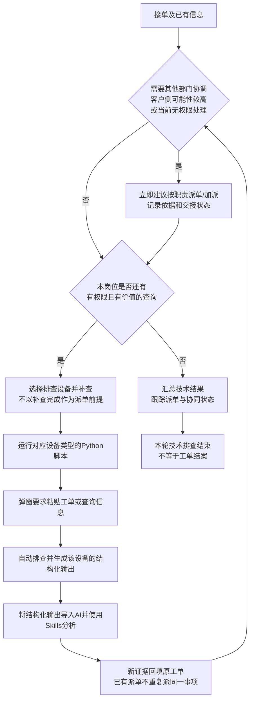

# 总纲处理流程

## 适用环境

- OLT和MSE通过4A系统登录，设备操作受4A审计。
- OLT和MSE分别使用对应的SecureCRT Python脚本进行自动查询和结构化输出。
- 3A通过Web页面人工查询，并整理为结构化结果。
- 电信生产内网不能访问公网，设备查询结果经人工检查和脱敏后搬运至公网AI。
- AI分析结果由人工带回内网，设备查询和操作仍由工作人员通过4A执行。

## 处理流程

## 流程原则

1. 排查设备由工作人员根据工单信息和当前进度选择。
2. OLT和MSE使用两套独立入口脚本，每次脚本只负责当前设备的采集和结构化输出。
3. 脚本提取工单信息后，应先展示关键查询对象供工作人员确认，再执行查询。
4. 每次只向AI提交一个设备或系统的结构化结果；同一工单应保持在同一个AI会话中，以便累积阶段性结论。
5. 及时派单是首要原则。需要其他部门协同、客户侧可能性较高或当前无权限处理时，立即建议派单；不得等待根因完全明确、全部采集完成或所有指标补齐。
6. 派单和继续排查分开判断，派单后可主动做有权限且有价值的白名单查询并回填证据，无需等待接手方要求；只停止越权、重复无收益或无必要的查询，不因已经派单而一律停止。
7. 本地网客户侧/现场问题指向对应地市政支/装维，OLT操作指向地市网操，MSE/SR/BRAS/CR/D/传输处理指向云网调度中心，工单管控指向客支中心-工单室；其他系统的权限缺口按实际归属派单。
8. 客户侧可能性较高或需要本地网核实时即可派对应地市协查，不必先完成定责；需要其他部门协调则按具体事项及时加派，不能仅为转出工单而无依据归责。
9. 挂单仅适用于客户不在、客户下班等非电信原因，必须记录时长并附录音、聊天记录等证据；电信原因或内部等待不得挂单。
10. 保护处理人：派单不及时是本业务首要考核风险。及时交接并留痕，补查不能延迟派单；未接单、退单、责任争议或超时风险交工单室协调，并行补查不代替派单跟踪。

## 异常判定要求

检查OLT/ONU光信息时，先对照 [质量参照标准](质量参照标准.md) 中对应制式和方向的阈值，将已测指标的实测值、阈值和结果写入判断依据，然后按原流程继续分析。

“发现异常”不能只表示某个数值偏离正常范围，还应判断该异常是否可能解释工单中的故障现象。

- 明确异常：证据充分，能够合理解释故障，可进入处置或派单。
- 疑似异常：存在异常迹象，但需要补充查询才能确定。
- 无异常：当前设备已完成必要查询，结果未见异常。
- 信息不足：脚本执行失败、关键字段缺失或输出无法解析，不能按无异常处理。

## 安全边界

- 搬运到公网AI之前，必须按单位安全要求检查并脱敏设备地址、用户信息、账号、序列号和拓扑信息。
- 不得向公网AI提交4A账号、设备密码、认证凭据或其他敏感信息。
- Skill命令清单中已收录的条目即用户确认的4A白名单，不再索要额外清单；AI只从中选取并替换模板已有参数，不补充清单外命令。实际回显拒绝时停止该路径并派单。
- 查询建议与配置操作必须明确区分。
- 当前岗位对MSE/SR/BRAS只有查看权限，不生成或执行变更命令；操作手册或人工确认不能替代权限。需要修复、刷新、重启等处理时派云网调度中心。
- 配置修改、重启、删除和业务刷新等操作必须人工核对目标设备、端口、用户和影响范围。
- 所有生产设备操作均通过4A人工执行，以保留审计记录。
- 派单/加派必须在服保中指向明确组织和岗位，并在工单中写明处理目标和证据。
